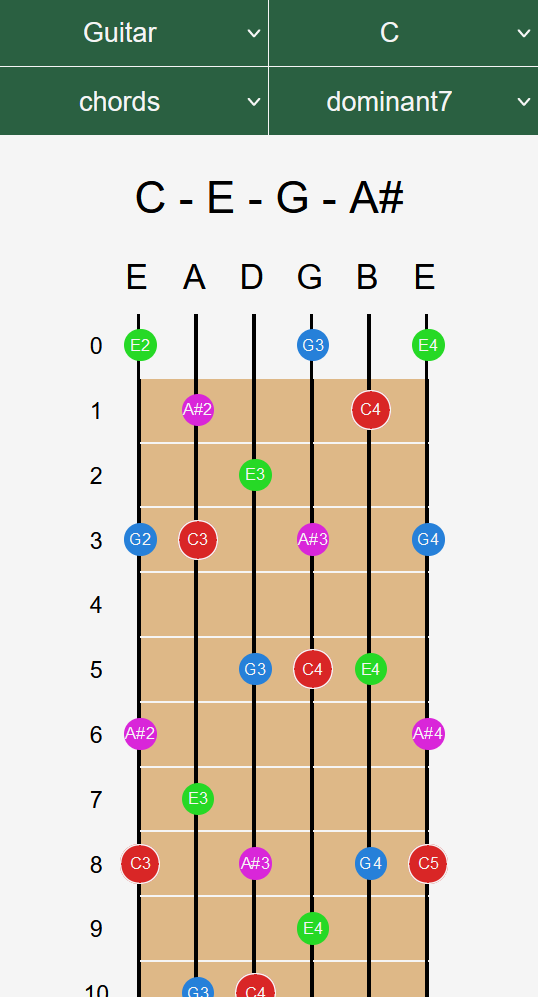

# Fretboard Map

This web application was created in order to help me explore fretboard of my baritone ukulele.  
The App generate string instrument representation (like guitar, bass, ukulele) and visualise notes, chords and scales. 

### Site

[Fretboard Map](https://fretboard-map.web.app/)
 

### Mobile support

The application is adapted to the screens of mobile devices. 

### Technologies

- JavaScript
- React
- HTML
- CSS

### Roadmap

I plan to develop the App in the direction that will help me better understand music theory.
Now i am working on Interactive Circle of Fifths. 